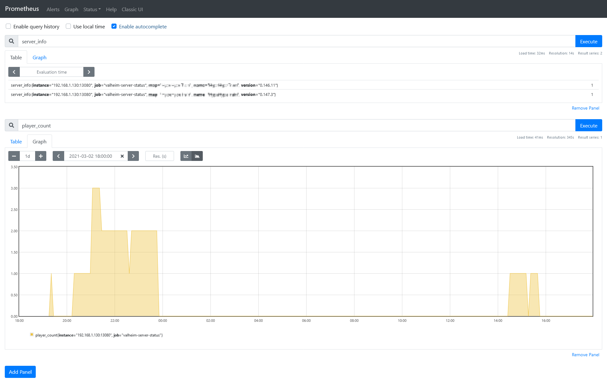

# valheim-server-status

Fetches basic information from your Valheim server and optionally sends Telegram messages when a player joins or leaves.

A query result is available as JSON via HTTP, along with optional Prometheus metrics — handy for embedding server status in a website or feeding dashboards.

## Features

- **Server status API** — JSON endpoint with player count, server name, map, and query timestamp
- **Telegram notifications** — get pinged when players join or leave (optional)
- **Prometheus metrics** — `player_count` and `server_info` gauges for scraping (optional)
- **Webhook endpoint** — accepts JSON POSTs and forwards them to Telegram, e.g. for [valheim-docker](https://github.com/mbround18/valheim-docker/blob/main/docs/webhooks.md) integration (optional)
- **CORS support** — allows embedding the status JSON in client-side JavaScript (optional)
- **Healthcheck** — built-in Docker healthcheck for orchestrators

## Quick Start (Docker)

Create a `docker-compose.yml` based on [docker-compose.example.yml](docker-compose.example.yml) and adjust the environment variables:

```bash
docker compose up -d
```

Or with `docker run`:

```bash
docker run -d --name valheim-server-status \
    -e VALHEIM_HOST='my.valheim.host' \
    -e VALHEIM_PORT='2457' \
    -e VALHEIM_QUERY_CRON='*/5 * * * *' \
    -e TELEGRAM_ENABLED='false' \
    -e METRICS_ENABLED='true' \
    -p 13080:13080 \
    aldjinn/valheim-server-status:latest
```

Then open <http://localhost:13080/status>.

## Environment Variables

| Variable                   | Default | Description                                                           |
| -------------------------- | ------- | --------------------------------------------------------------------- |
| `VALHEIM_HOST`             | —       | Hostname or IP of your Valheim server                                 |
| `VALHEIM_PORT`             | —       | Query port of your Valheim server                                     |
| `VALHEIM_QUERY_CRON`       | —       | Cron expression for query interval (e.g. `*/5 * * * *` = every 5 min) |
| `TELEGRAM_ENABLED`         | `false` | Enable Telegram notifications                                         |
| `TELEGRAM_CHAT_ID`         | —       | Telegram chat ID to send messages to                                  |
| `TELEGRAM_BOT`             | —       | Telegram bot token (`bot<token>:<secret>`)                            |
| `TELEGRAM_STARTUP_MESSAGE` | `false` | Send a message when the app starts                                    |
| `METRICS_ENABLED`          | `false` | Expose Prometheus metrics at `/metrics`                               |
| `WEBHOOK_ENABLED`          | `false` | Enable the `/webhook` endpoint                                        |
| `CORS_ENABLED`             | `false` | Send CORS headers on `/status`                                        |
| `CORS_ALLOW_ORIGIN`        | `*`     | Allowed origin for CORS                                               |

## Endpoints

| Endpoint        | Description                                                          |
| --------------- | -------------------------------------------------------------------- |
| `GET /`         | Simple name banner                                                   |
| `GET /status`   | Latest server query result as JSON                                   |
| `GET /version`  | Git commit info of the running build (ISO timestamps)                |
| `GET /metrics`  | Prometheus metrics (requires `METRICS_ENABLED=true`)                 |
| `POST /webhook` | Accepts JSON, forwards to Telegram (requires `WEBHOOK_ENABLED=true`) |

Example `/status` response:

```json
{
  "name": "TheBigBadWolf",
  "map": "TheBigBadWolf",
  "players": [ ... ],
  "numberOfPlayers": 1,
  "queryDate": "2026-09-08T12:34:56.000Z"
}
```

## Telegram

Configure `TELEGRAM_ENABLED`, `TELEGRAM_CHAT_ID` and `TELEGRAM_BOT`, and optionally `TELEGRAM_STARTUP_MESSAGE='true'` to receive a message when the application starts, plus join/leave notifications.


## Webhook

If `WEBHOOK_ENABLED='true'`, a webhook is available at `/webhook` which accepts any JSON payload via POST and forwards it to Telegram (Telegram settings must be configured and `TELEGRAM_ENABLED='true'`).

```bash
# test webhook with curl
curl -d '{"key1":"value1", "key2":"value2"}' \
    -H "Content-Type: application/json" \
    -X POST http://localhost:13080/webhook
```

## CORS

To consume `/status` from client-side JavaScript (e.g. embedding server status in a website), enable CORS:

```
CORS_ENABLED=true
CORS_ALLOW_ORIGIN=*
```

Set `CORS_ALLOW_ORIGIN` to a specific origin like `https://example.com` for tighter control. See the [MDN CORS docs](https://developer.mozilla.org/en-US/docs/Web/HTTP/CORS) for details.

## Prometheus

Metrics are available at `/metrics` when `METRICS_ENABLED='true'`:

```txt
# HELP player_count number of players
# TYPE player_count gauge
player_count 1

# HELP server_info server info
# TYPE server_info gauge
server_info{version="0.146.11",name="TheBigBadWolf",map="TheBigBadWolf"} 1
```



## Development

Requires Node.js 20+.

```bash
npm install
npm test      # run the test suite
node server.js
```

Create a `.env` file to override values from `.env.defaults`.

### Building the Docker image locally

```bash
docker build -t valheim-server-status:local .
docker run --rm -p 13080:13080 --env-file .env valheim-server-status:local
```

## Used Libraries

- query server data: [node-GameDig](https://github.com/gamedig/node-gamedig)
- cronjobs: [node-schedule](https://github.com/node-schedule/node-schedule)
- web framework: [express](https://github.com/expressjs/express)
- http client: [axios](https://github.com/axios/axios)
- env variable handling: [dotenv-defaults](https://github.com/mrsteele/dotenv-defaults)
- prometheus metrics: [prometheus-api-metrics](https://github.com/PayU/prometheus-api-metrics)
- prometheus client: [prom-client](https://github.com/siimon/prom-client)

## License

[MIT](LICENSE)
