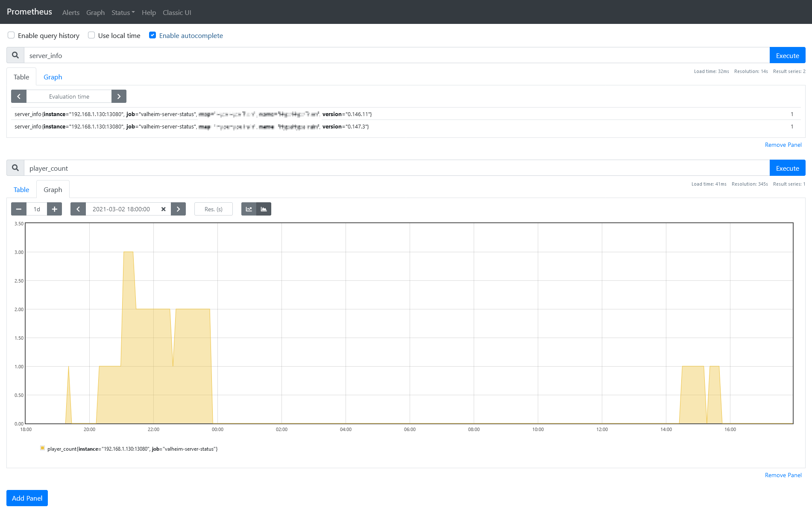

# valheim-server-status

Fetches some basic informations from your Valheim server and sends (optionally) messages to Telegram if a player joins or leaves your server.

Used libraries:

- query server data: [node-GameDig](https://github.com/gamedig/node-gamedig)
- cronjobs: [node-schedule](https://github.com/node-schedule/node-schedule)
- web framework: [express](https://github.com/expressjs/express)
- http client: [axios](https://github.com/axios/axios)
- env variable handling: [dotenv-defaults](https://github.com/mrsteele/dotenv-defaults)
- prometheus metrics: [prometheus-api-metrics](https://github.com/PayU/prometheus-api-metrics)
- prometheus client: [prom-client](https://github.com/siimon/prom-client)

## Development

First, install [Node.js](https://nodejs.org/) locally. Then create an .env file to override values from .env.defaults.

```bash
npm install
node server.js
```

Now open http://localhost:13080/status in your browser.

## Docker

First create a docker-compose.yml file based on the docker-compose.example.yml. Adjust the environment variables to your needs.

```bash
docker-compose up
```

Alternatively you can use docker run as well:

```bash
docker run -e VALHEIM_HOST='my.valheim.host' \
    -e VALHEIM_PORT='2457' \
    -e VALHEIM_QUERY_CRON='*/5 * * * *' \
    -e TELEGRAM_CHAT_ID='*-123456789' \
    -e TELEGRAM_BOT='bot123456789:nuG0iuy7ae9eVah5eef8tahXee6eij8nieD' \
    -e TELEGRAM_ENABLED='false' \
    -e TELEGRAM_STARTUP_MESSAGE='true' \
    -e METRICS_ENABLED='true' \
    -e WEBHOOK_ENABLED='false' \
    -p 13080:13080 \
    aldjinn/valheim-server-status:latest
```

Now open http://localhost:13080/status in your browser again.

## Telegram

If you have configured the Telegram settings correctly and TELEGRAM_STARTUP_MESSAGE='true', a message should be sent to your chat after the application has started. As well if someone joines or leaves the server.


## Webhook

If WEBHOOK_ENABLED='true', a webhook is available via http://localhost:13080/webhook which accepts any kind of JSON data via POST. The only functionality implemented yet is to forward the payload to Telegram. In this case, you must have configured the Telegram settings correctly and set TELEGRAM_ENABLED='true.'

For example, this can be used with the webhook support of [valheim-docker](https://github.com/mbround18/valheim-docker/blob/main/docs/webhooks.md).

```bash
# test webhook with curl
curl -d "{\"key1\":\"value1\", \"key2\":\"value2\"}" \
    -H "Content-Type: application/json" \
    -X POST http://localhost:13080/webhook
```

## Prometheus

Some metrics are available for scraping via http://localhost:13080/metrics if the application is started with METRICS_ENABLED='true'.

```
# HELP player_count number of players
# TYPE player_count gauge
player_count 1

# HELP server_info server info
# TYPE server_info gauge
server_info{version="0.146.11",name="TheBigBadWolf",map="TheBigBadWolf"} 1
```

[](prometheus.png)
