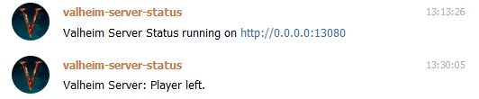

# valheim-server-status

Fetches some basic informations from your Valheim server and sends (optionally) messages to Telegram if a player joins or leaves your server.


## Development

Create .env file to override values from .env.defaults.

```bash
npm install
node server.js
```

Now open http://localhost:13080/ in your browser.

## Docker

First create a docker-compose.yml file based on the docker-compose.example.yml. Adjust the environment variables to your needs.

```bash
docker-compose build
docker-compose up
```

Now open http://localhost:13080/ in your browser again.

## Telegram

If you have configured the Telegram settings correctly, a similar message should be sent to your chat after the application has started.


